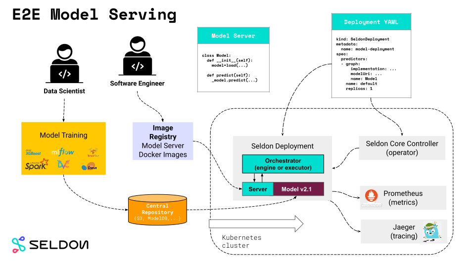

# 推理、部署和服务化

## 推理 Inference

相对于训练而言，推理指模型前向计算。

## 部署 Deployment

将模型部署到实际场景中使用，需要解决的问题包括：移植、压缩、加速等。

## 服务化 Serving

模型可以封装成 SDK，集成到 APP 或服务中；或封装成一个 Web 服务，对外暴露接口。

模型服务化包括：服务框架 + 前向推理计算。

# 常见服务化框架

| 服务框架           | 支持类型             | 开源仓库地址                                      | 开源时间 |
| ------------------ | -------------------- | ------------------------------------------------- | -------- |
| TensorFlow Serving | TensorFlow           | https://github.com/tensorflow/serving             | 2016     |
| TorchServe         | PyTorch              | https://github.com/pytorch/serve                  | 2020     |
| Triton             | TensorFlow/PyTorch等 | https://github.com/triton-inference-server/server | 2018     |
| BentoML            | TensorFlow/PyTorch等 | https://github.com/bentoml/BentoML                | 2019     |
| Kubeflow           | TensorFlow/PyTorch等 | https://github.com/kubeflow/kfserving             | 2019     |
| Seldon Core        | TensorFlow/PyTorch等 | https://github.com/SeldonIO/seldon-core           | 2018     |

# TensorFlow Serving

仅支持 TensorFlow 模型。

# TorchServe

仅支持 PyTorch 模型。

# Triton


主要特性：

- 支持多种该框架模型

- 推理性能优秀

- 工程部署友好

对架构图说明如下：

1. Triton 接入层，图中 C API 部分，支持 HTTP 和 gRPC 协议，除此职位，还支持共享内存的 IPC 机制

2. 模型仓库，Model Repository，可以是本地的持久化存储介质，或者是 Google Cloud Platform 或者 AWS S3。模型仓库支持多模型和模型编排机制

3. 预编排，Pre-Model Scheduler Queues 部分。模型编排，通过解析请求的 URL，从模型仓库查询到编排信息，执行编排

4. 前向推理计算，图中 Framework Backends 部分。支持主流框架模型，也支持用户扩展自己的推理引擎。统一称为 `Backend`，每种框架都是一种 `Backend`，实际上就时各个框架的 C++ API

5. 结果返回，图中 Inference Response 部分，把结果返回给客户端

6. State/Health Metric Export 部分，接入 Prometheus 监控

- 单模型多实例：对一个模型可以起多个实例，Triton会保证多实例的负载均衡，以提升请求吞吐量；

- 动态批处理：对于一个模型实例，Triton支持把多个请求缓存成一个batch，以利用率和吞吐量。

## ONNX 格式部署测试

### 服务端部署

- 拉取服务端镜像

```bash
$ docker pull nvcr.io/nvidia/tritonserver:21.04-py3
```

- 从 https://github.com/onnx/models 下载 resnet50 和 densenet 模型

- 从 https://github.com/triton-inference-server/server/tree/main/docs/examples/model_repository/densenet_onnx 下载 config.pbtxt 文件

- 将上述两个模型放到 Models 目录下，该目录文件结构如下：

```bash
.
|-- densenet_onnx
|   |-- 1
|   |   `-- model.onnx
|   |-- config.pbtxt
|   `-- densenet_labels.txt
`-- resnet50
    |-- 1
    |   `-- model.onnx
    |-- config.pbtxt
    `-- labels.txt
```


-  运行服务端容器，同时加载两个模型。注意，该容器可运行在纯 CPU 环境中。

```
$ docker run --gpus=1 --rm -p8000:8000 -p8001:8001 -p8002:8002 -v/full/path/to/docs/examples/model_repository:/models nvcr.io/nvidia/tritonserver:21.04-py3 tritonserver --model-repository=/models

......

I0525 12:52:37.429688 2354 server.cc:586]
+---------------+---------+--------+
| Model         | Version | Status |
+---------------+---------+--------+
| densenet_onnx | 1       | READY  |
| resnet50      | 1       | READY  |
+---------------+---------+--------+

I0525 12:52:37.429806 2354 tritonserver.cc:1658]
+----------------------------------+----------------------------------------------------------------------------------------+
| Option                           | Value                                                                                  |
+----------------------------------+----------------------------------------------------------------------------------------+
| server_id                        | triton                                                                                 |
| server_version                   | 2.9.0                                                                                  |
| server_extensions                | classification sequence model_repository model_repository(unload_dependents) schedule_ |
|                                  | policy model_configuration system_shared_memory cuda_shared_memory binary_tensor_data  |
|                                  | statistics                                                                             |
| model_repository_path[0]         | /models                                                                                |
| model_control_mode               | MODE_NONE                                                                              |
| strict_model_config              | 1                                                                                      |
| pinned_memory_pool_byte_size     | 268435456                                                                              |
| cuda_memory_pool_byte_size{0}    | 67108864                                                                               |
| min_supported_compute_capability | 6.0                                                                                    |
| strict_readiness                 | 1                                                                                      |
| exit_timeout                     | 30                                                                                     |
+----------------------------------+----------------------------------------------------------------------------------------+

I0525 12:52:37.431484 2354 grpc_server.cc:4028] Started GRPCInferenceService at 0.0.0.0:8001
I0525 12:52:37.431790 2354 http_server.cc:2761] Started HTTPService at 0.0.0.0:8000
I0525 12:52:37.474101 2354 http_server.cc:2780] Started Metrics Service at 0.0.0.0:8002
```

- 拉取客户端镜像

```bash
$ docker pull nvcr.io/nvidia/tritonserver:21.05-py3-sdk
```

- 执行客户端镜像

```bash
$ docker run -it --rm --net=host nvcr.io/nvidia/tritonserver:21.04-py3-sdk
```

- 执行客户端脚本

```bash
# resnet50 模型
$ /workspace/install/bin/image_client -m resnet50 -c 3 -s INCEPTION /workspace/images/mug.jpg

Request 0, batch size 1
Image '/workspace/images/mug.jpg':
    14.755353 (504) = COFFEE MUG
    12.505033 (968) = CUP
    8.436499 (967) = ESPRESSO

# densenet 模型
$ /workspace/install/bin/image_client -m densenet_onnx -c 3 -s INCEPTION /workspace/images/mug.jpg

Request 0, batch size 1
Image '/workspace/images/mug.jpg':
    15.349566 (504) = COFFEE MUG
    13.227467 (968) = CUP
    10.424895 (505) = COFFEEPOT
```

# BentoML

类似于MLflow，Python 层服务框架

# Kubeflow

## 安装

```bash
# 安装cert-manager
kubectl apply -f https://github.com/jetstack/cert-manager/releases/download/v1.3.1/cert-manager.yaml

# 安装 knative
kubectl apply -f https://github.com/knative/serving/releases/download/v0.23.0/serving-crds.yaml

kubectl apply -f https://github.com/knative/serving/releases/download/v0.23.0/serving-core.yaml

# 安装istio
curl -L https://istio.io/downloadIstio | sh -
cd istio-1.10.0
export PATH=$PWD/bin:$PATH
istioctl install --set profile=demo -y

# 安装kfserving
kubectl apply -f https://github.com/kubeflow/kfserving/releases/download/v0.5.1/kfserving.yaml
```

弹性伸缩能力

## Knative

```bash
# knative serving
# crd
kubectl apply -f https://github.com/knative/serving/releases/download/v0.23.0/serving-crds.yaml
# core components
kubectl apply -f https://github.com/knative/serving/releases/download/v0.23.0/serving-core.yaml

## network layer
kubectl apply -f https://github.com/knative/net-kourier/releases/download/v0.23.0/kourier.yaml

kubectl patch configmap/config-network \
  --namespace knative-serving \
  --type merge \
  --patch '{"data":{"ingress.class":"kourier.ingress.networking.knative.dev"}}'

# 查看外部 IP
kubectl --namespace kourier-system get service kourier
```

Hello world

```yaml
apiVersion: serving.knative.dev/v1 # Current version of Knative
kind: Service
metadata:
  name: helloworld-go # The name of the app
  namespace: default # The namespace the app will use
spec:
  template:
    spec:
      containers:
        - image: gcr.io/knative-samples/helloworld-go # Reference to the image of the app
          env:
            - name: TARGET # The environment variable printed out by the sample app
              value: "Go Sample v1"
```

```bash
kubectl apply --filename service.yaml

kubectl get ksvc helloworld-go

NAME            URL                                        LATESTCREATED         LATESTREADY           READY   REASON
helloworld-go   http://helloworld-go.default.example.com   helloworld-go-00001   helloworld-go-00001   True

curl -H "Host: helloworld-go.default.example.com" http://172.18.0.4:30604
```

autoscale

```bash
git clone -b "release-0.23" https://github.com/knative/docs knative-docs
cd knative-docs

kubectl apply --filename docs/serving/autoscaling/autoscale-go/service.yaml
```

```bash
$ kubectl get ksvc

NAME            URL                                        LATESTCREATED         LATESTREADY           READY   REASON
autoscale-go    http://autoscale-go.default.example.com    autoscale-go-00001    autoscale-go-00001    True
```

注意事项：
- 第一个请求响应
- 真实推理服务请求

```bash
$ hey -z 30s -c 50 -host "autoscale-go.default.example.com" http://172.18.0.2:30604?sleep=100\&prime=10000\&bloat=5

Summary:
  Total:        30.1161 secs
  Slowest:      1.8179 secs
  Fastest:      0.1038 secs
  Average:      0.1373 secs
  Requests/sec: 363.2935

  Total data:   1094031 bytes
  Size/request: 99 bytes

Response time histogram:
  0.104 [1]     |
  0.275 [10846] |■■■■■■■■■■■■■■■■■■■■■■■■■■■■■■■■■■■■■■■■
  0.447 [44]    |
  0.618 [0]     |
  0.789 [0]     |
  0.961 [0]     |
  1.132 [0]     |
  1.304 [0]     |
  1.475 [0]     |
  1.647 [0]     |
  1.818 [50]    |


Latency distribution:
  10% in 0.1114 secs
  25% in 0.1159 secs
  50% in 0.1231 secs
  75% in 0.1345 secs
  90% in 0.1548 secs
  95% in 0.1780 secs
  99% in 0.2632 secs

Details (average, fastest, slowest):
  DNS+dialup:   0.0000 secs, 0.1038 secs, 1.8179 secs
  DNS-lookup:   0.0000 secs, 0.0000 secs, 0.0000 secs
  req write:    0.0000 secs, 0.0000 secs, 0.0024 secs
  resp wait:    0.1371 secs, 0.1036 secs, 1.8138 secs
  resp read:    0.0002 secs, 0.0000 secs, 0.0074 secs

Status code distribution:
  [200] 10941 responses
```

```bash
$ kubectl get pods

NAME                                             READY   STATUS    RESTARTS   AGE
autoscale-go-00001-deployment-648c76cf6b-dcj4f   2/2     Running   0          33s
autoscale-go-00001-deployment-648c76cf6b-n5x2s   2/2     Running   0          31s
autoscale-go-00001-deployment-648c76cf6b-qvtkg   2/2     Running   0          29s
autoscale-go-00001-deployment-648c76cf6b-tldkv   2/2     Running   0          33s
autoscale-go-00001-deployment-648c76cf6b-vw7v8   2/2     Running   0          33s
autoscale-go-00001-deployment-648c76cf6b-xr8ft   2/2     Running   0          35s
autoscale-go-00001-deployment-648c76cf6b-z7kc9   2/2     Running   0          33s

```

多模型能力

动态加载、卸载模型

## KFServing

### 安装

使用 github 上的 [v0.5.1](https://github.com/kubeflow/kfserving/tree/v0.5.1) 版本，使用 `hack/quick_install.sh` 脚本安装，此脚本将安装 Istio, Knative Serving, KFServing

```bash
./hack/quick_install.sh
```

### tensorflow-serving 测试

```yaml
apiVersion: "serving.kubeflow.org/v1beta1"
kind: "InferenceService"
metadata:
  name: "flower-sample"
spec:
  predictor:
    tensorflow:
      storageUri: "gs://kfserving-samples/models/tensorflow/flowers"
```

```bash
kubectl apply -f tensorflow.yaml
```

创建了 InferenceService

```bash
kubectl get isvc flower-sample
NAME            URL                                        READY   PREV   LATEST   PREVROLLEDOUTREVISION        LATESTREADYREVISION                     AGE
flower-sample   http://flower-sample.default.example.com   True           100                                   flower-sample-predictor-default-n9zs6   7m15s
```

使用客户端发送请求

```bash
MODEL_NAME=flower-sample
INPUT_PATH=@./input.json
SERVICE_HOSTNAME=$(kubectl get inferenceservice ${MODEL_NAME} -o jsonpath='{.status.url}' | cut -d "/" -f 3)
curl -v -H "Host: ${SERVICE_HOSTNAME}" http://${INGRESS_HOST}:${INGRESS_PORT}/v1/models/$MODEL_NAME:predict -d $INPUT_PATH
```

结果如下：

```bash
*   Trying 172.18.0.3:32472...
* TCP_NODELAY set
* Connected to 172.18.0.3 (172.18.0.3) port 32472 (#0)
> POST /v1/models/flower-sample:predict HTTP/1.1
> Host: flower-sample.default.example.com
> User-Agent: curl/7.68.0
> Accept: */*
> Content-Length: 16201
> Content-Type: application/x-www-form-urlencoded
> Expect: 100-continue
>
* Mark bundle as not supporting multiuse
< HTTP/1.1 100 Continue
* We are completely uploaded and fine
* Mark bundle as not supporting multiuse
< HTTP/1.1 200 OK
< content-length: 222
< content-type: application/json
< date: Wed, 16 Jun 2021 08:56:37 GMT
< x-envoy-upstream-service-time: 1716
< server: istio-envoy
<
{
    "predictions": [
        {
            "scores": [0.999114931, 9.20989623e-05, 0.000136786475, 0.000337258185, 0.000300533167, 1.84814126e-05],
            "prediction": 0,
            "key": "   1"
        }
    ]
* Connection #0 to host 172.18.0.3 left intact
```

### 自动伸缩测试

```yaml
apiVersion: "serving.kubeflow.org/v1beta1"
kind: "InferenceService"
metadata:
  name: "flowers-sample"
  annotations:
    # 软性限制，当突发请求数量变多时，会将启动多个 Pod
    autoscaling.knative.dev/target: "1"
spec:
  predictor:
    # ContainerConcurrency 决定了 InferenceService 的每个副本在任何给定时间可以处理的并发请求数，这是一个硬限制，如果并发达到硬限制，多余的请求将被缓冲，并且必须等到有足够的可用容量才能执行请求
    containerConcurrency: 10
    # 该值默认为1，设置为0则可自动伸缩至0
    minReplicas: 0
    tensorflow:
      storageUri: "gs://kfserving-samples/models/tensorflow/flowers"
```

创建该 InferenceService 后，会创建相应的 Pod，若一段时间内没有请求到达，则 Pod 会自动停止。当环境中没有相关 Pod 时，客户端发送一个请求，InferenceService 会启动 Pod，并执行响应。启动 Pod 需要一定时间，所以第一个请求需要等待一段时间。

### 压力测试

```bash
MODEL_NAME=flowers-sample
INPUT_PATH=../tensorflow/input.json
HOST=$(kubectl get inferenceservice $MODEL_NAME -o jsonpath='{.status.url}' | cut -d "/" -f 3)
hey -q 50 -n 500 -t 0 -m POST -host ${HOST} -D $INPUT_PATH http://${INGRESS_HOST}:${INGRESS_PORT}/v1/models/$MODEL_NAME:predict
```

该命令行的意思是，qps 值为 50(-q 50)，总共发送 500 个请求(-n 500)，不限制超时时间，保证所有的请求都有回复(-t 0)。

当系统中不存在 Pod 时，即已伸缩到 0 时，请求响应情况如下：

```bash
Summary:
  Total:        64.4378 secs
  Slowest:      64.1147 secs
  Fastest:      0.3025 secs
  Average:      28.9904 secs
  Requests/sec: 1.5519

  Total data:   22200 bytes
  Size/request: 222 bytes

Response time histogram:
  0.303 [1]     |■■
  6.684 [1]     |■■
  13.065 [15]   |■■■■■■■■■■■■■■■■■■■■■■■■■
  19.446 [18]   |■■■■■■■■■■■■■■■■■■■■■■■■■■■■■■
  25.827 [12]   |■■■■■■■■■■■■■■■■■■■■
  32.209 [4]    |■■■■■■■
  38.590 [12]   |■■■■■■■■■■■■■■■■■■■■
  44.971 [24]   |■■■■■■■■■■■■■■■■■■■■■■■■■■■■■■■■■■■■■■■■
  51.352 [8]    |■■■■■■■■■■■■■
  57.734 [4]    |■■■■■■■
  64.115 [1]    |■■


Latency distribution:
  10% in 11.6015 secs
  25% in 16.2961 secs
  50% in 30.4080 secs
  75% in 42.9103 secs
  90% in 47.6061 secs
  95% in 51.7071 secs
  99% in 64.1147 secs

Details (average, fastest, slowest):
  DNS+dialup:   0.0006 secs, 0.3025 secs, 64.1147 secs
  DNS-lookup:   0.0000 secs, 0.0000 secs, 0.0000 secs
  req write:    0.0003 secs, 0.0001 secs, 0.0016 secs
  resp wait:    28.9892 secs, 0.3022 secs, 64.1113 secs
  resp read:    0.0001 secs, 0.0000 secs, 0.0002 secs

Status code distribution:
  [200] 100 responses
```

当系统中存在多个 Pod 时，即已伸缩至多个 Pod 时，请求响应情况如下：

```bash
Summary:
  Total:        27.7803 secs
  Slowest:      27.1565 secs
  Fastest:      0.6024 secs
  Average:      10.3386 secs
  Requests/sec: 3.5997

  Total data:   22200 bytes
  Size/request: 222 bytes

Response time histogram:
  0.602 [1]     |■
  3.258 [5]     |■■■■■■■
  5.913 [16]    |■■■■■■■■■■■■■■■■■■■■■■■■
  8.569 [27]    |■■■■■■■■■■■■■■■■■■■■■■■■■■■■■■■■■■■■■■■■
  11.224 [17]   |■■■■■■■■■■■■■■■■■■■■■■■■■
  13.879 [11]   |■■■■■■■■■■■■■■■■
  16.535 [4]    |■■■■■■
  19.190 [5]    |■■■■■■■
  21.846 [9]    |■■■■■■■■■■■■■
  24.501 [3]    |■■■■
  27.157 [2]    |■■■


Latency distribution:
  10% in 3.6536 secs
  25% in 6.3567 secs
  50% in 8.9949 secs
  75% in 13.3956 secs
  90% in 19.6559 secs
  95% in 22.4581 secs
  99% in 27.1565 secs

Details (average, fastest, slowest):
  DNS+dialup:   0.0003 secs, 0.6024 secs, 27.1565 secs
  DNS-lookup:   0.0000 secs, 0.0000 secs, 0.0000 secs
  req write:    0.0009 secs, 0.0001 secs, 0.0052 secs
  resp wait:    10.3372 secs, 0.6022 secs, 27.1552 secs
  resp read:    0.0001 secs, 0.0000 secs, 0.0002 secs

Status code distribution:
  [200] 100 responses
```

可以看到，所有的请求均有返回。

### 存储

以 S3 为例。

创建 S3 Secret 并附加到 ServiceAccount

```yaml
apiVersion: v1
kind: Secret
metadata:
  name: mysecret
  annotations:
     serving.kubeflow.org/s3-endpoint: s3.amazonaws.com # replace with your s3 endpoint e.g minio-service.kubeflow:9000
     serving.kubeflow.org/s3-usehttps: "1" # by default 1, if testing with minio you can set to 0
     serving.kubeflow.org/s3-region: "us-east-2"
     serving.kubeflow.org/s3-useanoncredential: "false" # omitting this is the same as false, if true will ignore provided credential and use anonymous credentials
type: Opaque
stringData: # use `stringData` for raw credential string or `data` for base64 encoded string
  AWS_ACCESS_KEY_ID: XXXX
  AWS_SECRET_ACCESS_KEY: XXXXXXXX

apiVersion: v1
kind: ServiceAccount
metadata:
  name: sa
secrets:
- name: mysecret
```

创建 InferenceService 时，设置对应的 serviceAccountName

```yaml
apiVersion: "serving.kubeflow.org/v1beta1"
kind: "InferenceService"
metadata:
  name: "flowers-s3"
spec:
  predictor:
    serviceAccountName: sa
    tensorflow:
      storageUri: "s3://kfserving-examples/flowers"
```

### 自定义镜像测试

以 ai-gallery 的安全帽推理模型为例，该镜像地址为 `harbor.orientalmind.cn/ai-gallery/helmet_detect_tf2_mlflow:0.1`，创建的 InferenceService 的配置文件如下：

```yaml
apiVersion: "serving.kubeflow.org/v1beta1"
kind: "InferenceService"
metadata:
  name: "helmet"
  annotations:
    autoscaling.knative.dev/target: "1"
spec:
  predictor:
    minReplicas: 0
    containers:
    - image: harbor.orientalmind.cn/ai-gallery/helmet_detect_tf2_mlflow:0.1
      name: helmet
      ports:
        - containerPort: 5000
          protocol: TCP
```

容器内部设置暴露端口5000，配置文件中要保持一致。部署完成后，使用客户端脚本访问，可得到正确结果。

### 多模型测试

在 KFServing 中，多模型处于 [Alpha](https://github.com/kubeflow/kfserving/tree/v0.5.1/docs/samples/multimodelserving/triton) 版本状态，主要使用 triton 的能力支持多模型。

待测试：
- 依赖 GPU 节点
- 是否支持纯 CPU 节点

# Seldon Core


Seldon Core 支持简单的模型推理场景，也支持有向无环的推理图场景。比如在图中的第二个复杂的推理图，一共展示了四个特殊的模型服务的步骤组成的工作流。首先是 Explanation，它负责进行模型的解释。接下来是异常值检测，然后是特征转换 Transformer，最后是通过一个 Router，将流量路由到 A,B,C 三个模型中表现最好的模型中。

## 核心概念

抽象出五个组件

- Model：模型，提供 REST 和 gRPC 服务。

- Router：路由组件，还接受来自各个路由的节点的 reward feedback（激励反馈）
- Combiner：一个跟 Router 类似的组件，区别在于它不是路由到某个节点，而是将其下所有的节点的输出进行结合，输出一个结合后的唯一的返回
- Transformer：负责做输入的转换，预处理过程
- Output_Transformer：负责做输出的转换，后处理过程

## 系统工作流

Seldon Core 以 Kubernetes CRD 的方式对外提供能力。它提供的 CRD 叫做 SeldonDeployment

Seldon Core 使用 PodTemplateSpec 来表示组件的定义。接下来是推理图的定义，类似于 Argo Workflow 的 DAG 定义。

当用户创建了 CRD 后，Seldon Core 的 Operator 会根据 CRD 的 Spec 创建对应的组件，并且对外暴露 RESTful 和 gRPC 的服务接口。其中组件是以容器的方式运行的，当用户访问暴露的服务接口时，Seldon Core 会根据用户在 CRD 的 Spec 中定义的 DAG 推理图来编排请求。

## 系统设计

在推理图功能的实现中，Seldon Core 依赖一个 Golang 实现的 Executor

举例说明，当用户定义了推理图时，除了对应的组件，Seldon Core 会为图创建一个 Engine 实例。在这一推理图中，一共三个组件，分别是 Transformer，Router 和三个 Model。Transformer 负责做特征转换，Router 负责将请求路由到三个模型中表现最优的一个，三个模型各自提供服务。

在这一过程中，用户会通过 POST 调用 /api/v1.0/predictions 来访问这一推理图。请求会首先到达 Engine。Engine 会根据推理图的拓扑序，依次访问不同的组件。在这一例子中，首先调用 Transformer 提供的 /transform-input 接口，进行特征转换，随后调用 Router 选择出最优的模型实例。随后，将 Transformer 处理后的 Response 作为 Request 转发给最优模型，最后得到输出，并且发回给用户。

如果只是简单的模型推理，不需要推理图，可以通过修改 annotation 的方式为当前 SeldonDeployment 禁用 Engine。少一层应用层的网络转发，在 latency 上会有所改善。Seldon Core 中的分布式追踪能力，也是在 Engine 中实现的。通过在每次转发时做一些埋点，可以便捷地实现这一功能。

## Model Servers



1. 算法工程师提供用于推理服务的模型，上传到中心仓库，如 S3
2. 软件工程师使用 Seldon Deployment CRD 在 k8s 上部署模型，Seldon Core Operator 管理资源
3. 客户端服务请求被编排器统一管理
4. 可接入第三方资源监控

若使用 Non-Reusable Model Servers，则将模型嵌入到容器中

## Language Warppers

使用该组件，可以直接加载 Python 类，用于模型推理。

`Model.py`

```python
class Model:
  def __init__(self, ...):
    """Custom logic that prepares model.

    - Reusable servers: your_loader downloads model from remote repository.
    - Non-Reusable servers: your_loader loads model from a file embedded in the image.
    """
    self._model = your_loader(...)

  def predict(self, features, names=[], meta=[]):
    """Custom inference logic.""""
    return self._model.predict(...)
```

```bash
$ seldon-core-microservice Model --service-type MODEL
```

客户端命令：

```bash
$ curl http://localhost:9000/api/v1.0/predictions \
    -H 'Content-Type: application/json' \
    -d '{"data": {"names": ..., "ndarray": ...}}'

{
   "meta" : {...},
   "data" : {"names": ..., "ndarray" : ...}
}
```

## Seldon Deployment CRD

使用通用的 YAML 配置文件进行模型部署，配置文件可配置 Seldon Core 的组件。

## Seldon Core Operator

读取 CRD 指定的资源，并进行资源创建管理。

## Service Orchestrator

管理内部图结构数据流向路由。

外接监控组件，如 Prometheus 等。


## 安装

```bash
$ kubectl create namespace seldon-system

$ helm install seldon-core seldon-core-operator \
    --repo https://storage.googleapis.com/seldon-charts \
    --set usageMetrics.enabled=true \
    --set certManager.enabled=true \
    --set istio.enabled=true \
    --namespace seldon-system
```

## Ingress 配置

待测试补充


## 创建 TF Serving 服务

```yaml
apiVersion: machinelearning.seldon.io/v1alpha2
kind: SeldonDeployment
metadata:
  name: tfserving
spec:
  name: flowers
  predictors:
  - graph:
      children: []
      implementation: TENSORFLOW_SERVER
      modelUri: gs://kfserving-samples/models/tensorflow/flowers
      name: flowers-model
    name: default
    replicas: 1
```

如何访问？是否需要配置 Ingress？

## 创建 Triton 服务


# 对比表格

| 特性         | KFServing    | Seldon Core  |
| ------------ | ------------ | ------------ |
| TF Serving   | ✓            | ✓            |
| Triton       | ✓            | ✓            |
| 弹性伸缩     | ✓            | ✓            |
| 伸缩至0      | ✓            | X            |
| 多模型       | ✓            | ✓            |
| 单镜像多模型 | ✓(TF/Triton) | ✓(TF/Triton) |
| 多镜像多模型 | ✓            | ✓            |
| HTTP/GPRC    | ✓(TF/Triton) | ✓(TF/Triton) |
| GPU          | ✓(TF/Triton) | ✓(TF/Triton) |

弹性伸缩，到0

多模型：单镜像多模型，多镜像多模型

多模型路由机制：基于URL路径、基于域名

多租户、审计（调用次数统计）

协议支持：HTTP/GRPC