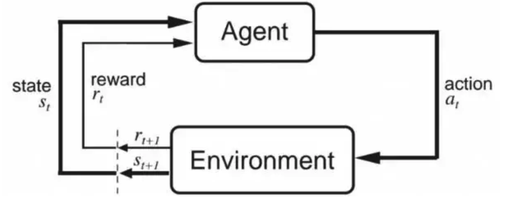

# 强化学习定义

它主要包含五个元素，Agent（智能体），Environment（环境），State（状态），Action（行动），Reward（奖励）,强化学习的目标就是获得最多的累计奖励。

在某个时间步 $t$，智能体处于状态 $S_t$，采取动作 $a_t$，则环境会返回一个新的状态 $S_{t+1}$ 和一个奖励 $\gamma_{t+1}$。奖励处于 $t+1$ 时间步，是因为它是由环境在 $t+1$ 的状态 $S_{t+1}$ 返回的。

# 强化学习的基本概念

- State(缩写s)：环境的状态，$t$ 时刻的环境状态 $S_t$ 是它环境状态集中的某一个状态。状态是决策的唯一依据；
- State Space(状态空间)：所有可能存在状态的集合，记为 $S$。状态空间可以是有限集合，也可以是无限集合；
- Action(缩写a)：智能体的动作，$t$ 时刻个体采取的动作 $a_t$ 是它的动作集中的某一个动作；
- Action Space(动作空间)：所有可能的动作的集合，记为 $A$；
- Agent(智能体)：指动作的主体；
- Reward(缩写r)：环境的奖励，$t$ 时刻个体在状态 $S_t$ 采取的动作 $a_t$ 对应的奖励 $\gamma_{t+1}$ 会在 $t+1$ 时刻得到；
- Policy(缩写 $\pi$ )：个体的策略，它代表个体采取动作的依据，即个体会依据策略 $\pi$ 来选择动作。最常见的策略表达方式是一个条件概率分布 $\pi(a|s)$, 即在状态s时采取动作a的概率。即 $\pi(a|s)=P(a_t=a|s_t=s)$。此时概率大的动作被个体选择的概率较高；
- Value(缩写v)：个体在策略 $\pi$ 和状态 $s$ 时，采取行动后的价值，一般用 $v_{\pi}(s)$ 表示。这个价值一般是一个期望函数；
- State Transition(状态转移)：指当前状态 $s$ 变成新的状态 $s'$，给定当前状态 $s$ ，智能体执行动作，环境给出下一时刻状态 $s'$，这个计算函数叫做状态转移函数。状态转移函数可以是确定的，或者是随机的；
- 随机状态转移函数：$p(s'|s,a)=P(S'=s'|S=s,A=a)$，如果观测到当前状态 $s$ 以及动作 $a$，则 $p$ 函数输出状态变成 $s'$。确定状态转移时随机状态转移的一个特例；
- Environment(环境)：用于生成新的状态；
- $\gamma$ 是模型要素，则奖励衰减因子，在[0,1]之间，若为0，则为贪婪法，即价值仅由当前延时奖励决定；若为1，则将后续的状态奖励与当前奖励一视同仁；
- 环境的状态转化模型，在状态 $s$ 下采取动作 $a$，转到下一个状态 $s'$ 的概率，表示为 $P_{ss'}^a$；
- 探索率 $\epsilon$，在强化学习训练迭代过程中，一般会选择使当前轮迭代代价值最大的动作。将有一定概率不选择使代价值最大的动作，而选择其他动作。

## 随机性来源

1. 动作的随机性来源于策略函数。策略函数计算出动作空间每个动作的概率值，智能体执行的动作是随机抽样的结果，所以结果带有随机性；
2. 状态的随机性来源于状态转移函数。当状态和动作都确定下来，下一个状态仍然有随机性；
3. 奖励可以看作状态和动作的函数。给定当前状态和动作，则奖励是唯一确定的。有些应用中，奖励不仅取决于当前状态和动作，还取决于下一个状态；
4. 轨迹 (Trajectory) 是指一回合 (Episode) 游戏中，智能体观测到的所有的状态、动作、奖励。

## 回报与折扣回报

回报是折扣率为 1 的特殊折扣回报

### 回报

回报（Return）指从当前时刻开始到一回合结束的所有奖励的综合，也叫做累计奖励。$t$ 时刻的回报记为随机变量 $U_t$，若一局游戏结束，已经观测到所有奖励，回报则记为 $u_t$，回报的定义是：

$$ U_t = R_t + R_{t+1} + R_{t+2} + ...$$

回报是未来获得的奖励总和，所以智能体的目标就是让回报尽量大。强化学习的目标就是寻找一个策略，使得回报的期望最大化，而不是当前的奖励最大化。

### 折扣回报

在强化学习中，通常使用折扣回报，给未来的奖励做折扣：

$$ U_t = R_t + \gamma * R_{t+1} + \gamma^2 * R_{t+2} + \gamma^3 * R_{t+3} + ... $$

其中 $\gamma \in [0, 1]$ 称为折扣率，是超参数。

### 回报中的随机性

在 $t$ 时刻，已观测到 $s_t$ 及其之前的状态、动作、奖励，而后续的随机变量未观测到。

此时，$U_t$ 的随机性来源于后续的动作和状态，动作的随机性来源于策略函数，状态的随机性来源于状态转移函数。

## 价值函数

### 动作价值函数

在 $t$ 时刻，动作价值函数

$$ Q_\pi(S_t, a_t) = E_{S_{t+1}, A_{t+1}, ...}[U_t | S_t = s_t, A_t = a_t] $$

该函数依赖以下三个因素

1. 当前状态 $s_t$。当前状态越好，则动作价值函数越大，回报的期望值越大
2. 当前动作 $a_t$。智能体执行的动作越好，则动作价值函数越大，回报的期望值越大
3. 策略函数 $\pi$。策略决定未来动作 $A_{t+1}, A_{t+2},..., A_n$，策略越好，则动作价值函数越大，回报的期望值越大

### 最优动作价值函数

排除掉策略 $\pi$ 的影响，只评价当前状态和动作的好坏，需要使用最优动作价值函数

$$ Q_{\star}(s_t, a_t) = max Q_{\pi}(s_t, a_t)$$

该函数计算出各个动作对应的回报期望最大值。

### 状态价值函数

该函数表示在这个状态下，一直到最终状态的回报期望值。该函数仅依赖策略 $\pi$ 和当前状态 $s_t$，不依赖于动作。

$$ V_\pi(S_t) = E_{A_t, S_{t+1}, A_{t+1}, ...}[U_t | S_t = s_t] $$

该函数衡量策略 $\pi$ 与状态 $s_t$ 的好坏

## 策略学习和价值学习

强化学习分为两类：

- 基于模型的方法，Model-Based
- 无模型方法，Model-Free

其中无模型方法，又可分为

- 价值学习，指学习最优价值函数 $Q_{\star}(s,a)$，或者动作价值函数、状态价值函数。智能体根据 $Q_{\star}$ 做决策，选出对应 Q 值最大的动作。Q 值的意思是期望回报。学习方式是智能体收集状态、动作、奖励，作为训练数据，学习一个表格或者神经网络，用于近似 $Q_{\star}$

- 策略学习，指学习策略函数 $\pi(a|s)$，用于计算所有动作的概率值，并随机抽样选出一个动作执行。学习方式是使用策略梯度，学习 $\pi$
